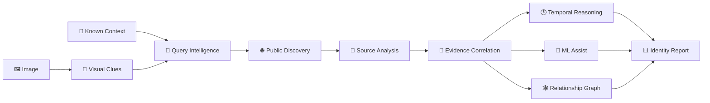
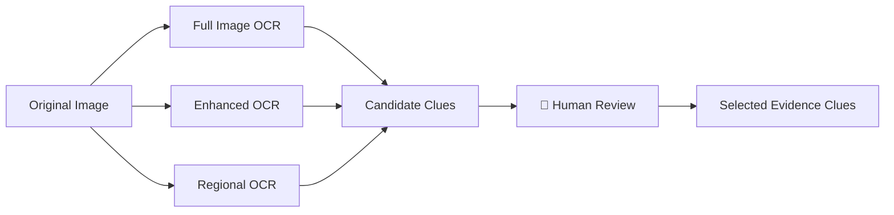
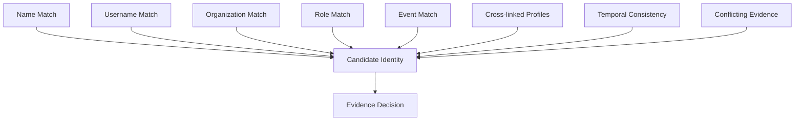
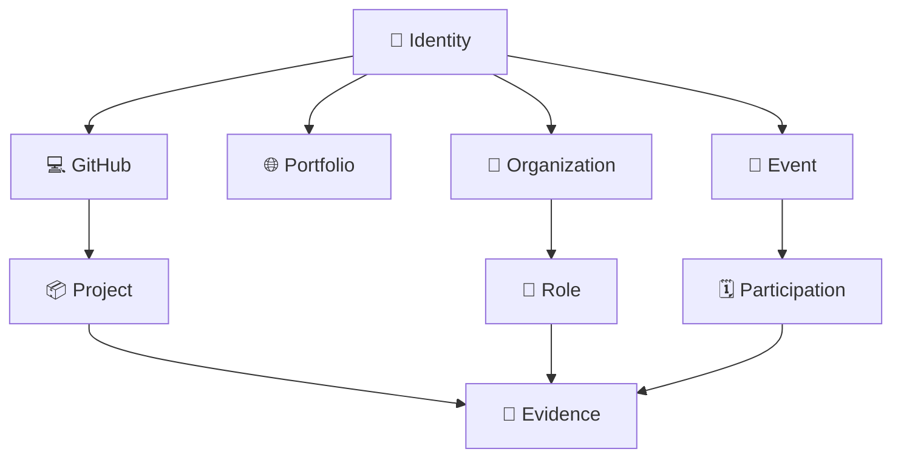
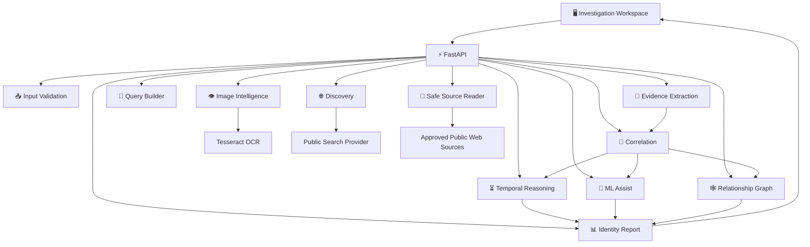

<div align="center">

#  TEMPORAL NEXUS

### **Connect the traces. Resolve the identity.**

**Evidence-first Public Digital Identity Intelligence**

<br>


<br>

### One person.

### Many digital traces.

### One evidence-backed identity story.

---

**NEURAX Hackathon 3.0 · AI in Cybersecurity**

</div>

---

# 🔷 What is Temporal Nexus?

Imagine starting with only:

> 🖼️ **A photograph**
> 👤 **A name or username**
> 🏢 **Maybe an organization**

Across the public internet, that same person may appear in completely different forms:

| 🌐 Source             | Possible Trace            |
| --------------------- | ------------------------- |
| GitHub                | Username + projects       |
| Event Page            | Name + participation      |
| Organization Site     | Name + role               |
| Portfolio             | Skills + projects         |
| Professional Profile  | Employment history        |
| Publication           | Name + research           |
| Public Social Profile | Username + identity clues |

The problem is not simply finding these pages.

The real problem is:

<div align="center">

## **How do we know they belong to the same person?**

</div>

Temporal Nexus converts scattered public information into an **explainable evidence graph** instead of blindly merging search results.

---

# 🧬 The Nexus



<div align="center">

### `INPUT → CLUES → DISCOVERY → EVIDENCE → CORRELATION → IDENTITY`

</div>

---

# 🚀 Investigation Workspace

Temporal Nexus is built as a **six-stage investigation pipeline**.

<table>
<tr>

<td width="33%" valign="top">

### ① 📥 CASE INPUT

Upload the authorized reference image and provide whatever information is already known.

**Accepts**

* Name
* Username
* Organization
* Role
* Department
* Reference image

</td>

<td width="33%" valign="top">

### ② 👁️ IMAGE INTELLIGENCE

The image is analyzed locally for useful contextual information.

**Extracts**

* Event names
* Organization names
* Badge text
* Usernames
* Visible labels
* Scene text

</td>

<td width="33%" valign="top">

### ③ 🧠 QUERY INTELLIGENCE

Approved clues are converted into explainable public-search queries.

Every query preserves:

**WHAT triggered it**
and
**WHY it was generated**

</td>

</tr>

<tr>

<td width="33%" valign="top">

### ④ 🌐 DISCOVERY

Temporal Nexus searches for possible public traces.

Results remain:

### ⚠️ UNVERIFIED

until supporting evidence is found.

</td>

<td width="33%" valign="top">

### ⑤ 📄 SOURCE INTELLIGENCE

Selected public pages are inspected for subject-specific evidence.

The system extracts structured observations instead of blindly trusting snippets.

</td>

<td width="33%" valign="top">

### ⑥ 🔗 CORRELATION

Evidence from multiple sources is compared.

The final result includes:

* supported claims
* conflicts
* missing evidence
* timelines
* profiles
* relationships

</td>

</tr>
</table>

---

# 👁️ Image Intelligence

A photograph can contain much more information than a face.

Temporal Nexus looks for **context surrounding the subject**.



### Example

A photograph might contain:

> **NEURAX HACKATHON 3.0**
> **CMR Technical Campus**

These become potential investigation clues.

But Temporal Nexus does **not** make the mistake of assuming:

> "The text appeared near the person, therefore it describes the person."

The clue is only used to **guide discovery**.

---

# 🎛️ Human-in-the-Loop Intelligence

OCR is useful.

OCR is also imperfect.

That is why Temporal Nexus places a human review stage between extraction and investigation.

The reviewer can:

✅ correct OCR mistakes
✅ change clue categories
✅ remove irrelevant text
✅ select useful clues
✅ add clearly visible missed clues
✅ preserve the original OCR evidence

Example:

```text
OCR detected:
Al3x D3mo

Reviewer correction:
Alex Demo
```

Both values remain distinguishable.

The correction does not silently overwrite the original observation.

---

# 🛰️ Explainable Discovery

Temporal Nexus does not hide its search logic.

Every generated query can explain:

```text
QUERY
"Alex Kumar" "NEURAX Hackathon"

WHY?
Name supplied by investigator
+
Event extracted from reviewed image clue
```

This creates an investigation that can be inspected instead of a black-box result.

---

# 🌐 Candidate Discovery

Discovery can locate public traces such as:

<div align="center">


</div>

But discovery is deliberately separated from verification.

<div align="center">

### 🔴 FOUND ≠ VERIFIED

</div>

A candidate result becomes useful only after its contents support the identity association.

---

# 🧩 Source Intelligence

Temporal Nexus examines selected public sources and turns webpage content into structured observations.

Instead of storing an entire page as one giant block of text:

```text
PAGE
↓
OBSERVATIONS
```

For example:

| Evidence Type   | Observation          |
| --------------- | -------------------- |
| 👤 Name         | Alex Kumar           |
| 🪪 Username     | alexk_dev            |
| 🏢 Organization | CMR Technical Campus |
| 💼 Role         | Developer            |
| 🎯 Event        | NEURAX Hackathon     |
| 💻 Project      | Temporal Nexus       |
| 📍 Location     | Hyderabad            |
| 🗓️ Date        | September 2026       |

Every important observation keeps a reference to its source.

---

# 🔗 Identity Correlation Engine

This is the core of Temporal Nexus.

Instead of asking:

> **"Do the names look similar?"**

Temporal Nexus asks:

> **"How much independent evidence connects these traces?"**



---

# 🚦 Evidence States

Temporal Nexus avoids pretending that every result can be reduced to one magical percentage.

Instead, evidence receives meaningful states.

<table>
<tr>
<td>

### 🟢 SUPPORTED

Evidence actively supports the association.

</td>

<td>

### 🟡 PARTIAL

Evidence exists but is incomplete.

</td>
</tr>

<tr>
<td>

### 🔴 CONFLICTING

Evidence directly disagrees with the supplied identity.

</td>

<td>

### ⚪ MISSING

The expected evidence could not be found.

</td>
</tr>
</table>

This distinction matters.

**Missing evidence is not the same as contradictory evidence.**

---

# 🧠 ML-Assisted Correlation

Temporal Nexus contains a lightweight **custom logistic-regression correlation layer**.

It evaluates signals including:

```text
Name similarity
Username agreement
Organization agreement
Role agreement
Department agreement
Profile cross-links
Evidence density
Missing evidence
Temporal consistency
Explicit conflicts
```

The model produces an **association assistance score**.

But:

<div align="center">

### ⚠️ ML IS NOT THE FINAL AUTHORITY

</div>

The deterministic evidence layer remains authoritative.

If direct evidence contradicts an identity association, the ML system is not allowed to simply override that contradiction.

---

# ⏳ Temporal Intelligence

Identity changes over time.

A person may:

```text
2023 → Student

2024 → Hackathon Participant

2025 → Intern

2026 → Developer
```

An old affiliation should not automatically be treated as false.

Temporal Nexus therefore separates:

🟣 **Historical Evidence**

from

🔵 **Current Evidence**

and

🔴 **Temporal Conflict**

---

# 🕸️ Relationship Graph

The final identity can be viewed as a network of evidence-backed relationships.



Possible node types include:

`Identity` · `Profile` · `Organization` · `Role` · `Project` · `Event` · `Publication` · `Education` · `Location`

---

# 📊 Identity Resolution Report

The final output is not merely a list of URLs.

It becomes an investigation report containing:

<table>
<tr>

<td width="50%">

### 👤 Most Supported Identity

Canonical identity being investigated.

</td>

<td width="50%">

### 🌐 Connected Public Footprint

Profiles and pages with sufficient supporting evidence.

</td>

</tr>

<tr>

<td>

### 🕒 Timeline

Historical and current observations.

</td>

<td>

### 🕸️ Relationship Graph

Evidence-backed identity connections.

</td>

</tr>

<tr>

<td>

### 📚 Evidence

Traceable supporting observations.

</td>

<td>

### ⚠️ Conflicts

Contradictory or unresolved information.

</td>

</tr>

</table>

---

# 🏗️ Architecture



---

# 🛠️ Technology Core

<div align="center">


</div>

| Layer                | Technology                             |
| -------------------- | -------------------------------------- |
| ⚡ API                | FastAPI                                |
| 🐍 Backend           | Python                                 |
| 🖥️ Frontend         | HTML + CSS + JavaScript                |
| 👁️ OCR              | Tesseract + pytesseract                |
| 🖼️ Image Processing | Pillow                                 |
| 🔎 Discovery         | Public search integration              |
| 🤖 ML                | Custom lightweight logistic regression |
| 🧪 Testing           | Automated + manual workflow testing    |

---

# 📂 Project Structure

```text
Temporal_Nexus
│
├── ⚡ backend
│   ├── main.py
│   ├── models.py
│   ├── database.py
│   │
│   └── services
│       ├── input_validation.py
│       ├── image_clues.py
│       ├── indexed_clues.py
│       ├── query_builder.py
│       ├── discovery.py
│       ├── source_reader.py
│       ├── extraction.py
│       ├── profiles.py
│       ├── profile_records.py
│       ├── profile_markup.py
│       ├── profile_consolidation.py
│       ├── correlation.py
│       ├── ml_correlation.py
│       ├── temporal_reasoning.py
│       ├── relationship_graph.py
│       └── identity_report.py
│
├── 🎨 frontend
│   ├── index.html
│   ├── styles.css
│   ├── app.js
│   └── report.js
│
├── 🗃️ data
├── 🧪 tests
│
├── .env.example
├── requirements.txt
├── MANUAL_TESTING.md
└── README.md
```

---

# ⚙️ Run Temporal Nexus

<details>

<summary><b>1️⃣ Clone the repository</b></summary>

```bash
git clone https://github.com/sdheeraj4/Temporal_Nexus.git
cd Temporal_Nexus
```

</details>

<details>

<summary><b>2️⃣ Create the virtual environment</b></summary>

### Windows

```powershell
python -m venv .venv
.venv\Scripts\Activate.ps1
```

### Linux / macOS

```bash
python3 -m venv .venv
source .venv/bin/activate
```

</details>

<details>

<summary><b>3️⃣ Install dependencies</b></summary>

```bash
pip install -r requirements.txt
```

</details>

<details>

<summary><b>4️⃣ Configure environment</b></summary>

Create:

```text
.env
```

using:

```text
.env.example
```

Never commit the real `.env`.

</details>

<details>

<summary><b>5️⃣ Start the application</b></summary>

```bash
uvicorn backend.main:app --reload
```

Open:

```text
http://127.0.0.1:8000
```

API documentation:

```text
http://127.0.0.1:8000/docs
```

</details>

---

# 🎬 Demo Journey

A Temporal Nexus demonstration follows one continuous investigation.


### Demo sequence

**1. Upload**
Reference image + known identity context.

**2. Inspect**
Temporal Nexus extracts visual clues.

**3. Correct**
Reviewer fixes or selects OCR clues.

**4. Discover**
Explainable queries locate public candidates.

**5. Investigate**
Selected sources are converted into structured evidence.

**6. Resolve**
Correlation compares independent identity signals.

**7. Explain**
Timeline, relationships, evidence and conflicts are shown together.

---

# 🛡️ Security Boundaries

<div align="center">

### Temporal Nexus is built for

### **AUTHORIZED PUBLIC-INFORMATION INVESTIGATION**

</div>

### ✅ Designed to

* analyze authorized input;
* inspect public information;
* preserve evidence provenance;
* expose uncertainty;
* keep human review in the loop;
* distinguish clues from proof;
* detect conflicting information.

### ❌ Not designed to

* access private accounts;
* bypass authentication;
* exploit websites;
* use leaked databases;
* bypass access controls;
* hide contradictory evidence;
* treat matching names as identity proof.

---

# 👤 About Facial Identification

Temporal Nexus currently uses the image primarily for:

> **contextual visual intelligence**

such as:

* badges;
* banners;
* organizations;
* events;
* usernames;
* visible contextual text.

The project does **not claim that a face alone proves ownership of an online account**.

Even a facial similarity result would still require independent supporting evidence.

That principle is consistent throughout Temporal Nexus:

<div align="center">

## **A clue can start an investigation.

Only evidence can support the connection.**

</div>

---

# ✅ Build Status

| Module                | Status |
| --------------------- | :----: |
| Input Validation      |   🟢   |
| Consent Workflow      |   🟢   |
| Image Intelligence    |   🟢   |
| OCR Review            |   🟢   |
| Query Intelligence    |   🟢   |
| Public Discovery      |   🟢   |
| Source Reader         |   🟢   |
| Evidence Extraction   |   🟢   |
| Profile Normalization |   🟢   |
| Identity Correlation  |   🟢   |
| ML Assist             |   🟢   |
| Temporal Reasoning    |   🟢   |
| Timeline Generation   |   🟢   |
| Relationship Graph    |   🟢   |
| Identity Report       |   🟢   |
| Investigation UI      |   🟢   |

<div align="center">


</div>

---

# 🔐 Evidence Philosophy

Temporal Nexus follows four simple rules:

<table>

<tr>

<td align="center">

### 🔍

### FIND

Discover possible traces.

</td>

<td align="center">

### 📄

### VERIFY

Inspect what the source actually says.

</td>

<td align="center">

### 🔗

### CORRELATE

Compare independent evidence.

</td>

<td align="center">

### 🧾

### EXPLAIN

Show why the connection exists.

</td>

</tr>

</table>

---

# 💡 Why Temporal Nexus Is Different

Most tools answer:

> **Where does this name appear?**

Temporal Nexus attempts to answer:

> **Which traces can actually be connected?**

> **What evidence supports that connection?**

> **When was that information true?**

> **What contradicts it?**

> **What still remains uncertain?**

---

# ⚠️ Current Limitations

Temporal Nexus is a hackathon prototype and intentionally exposes its limitations.

* Search engines cannot discover every public record.
* OCR quality depends on image quality.
* Some websites prevent automated reading.
* JavaScript-heavy pages may expose limited content.
* Public information itself may be incorrect.
* Similar names can produce unrelated candidates.
* Missing evidence does not prove something is false.
* ML assistance is not a calibrated identity probability.
* Public-profile correlation does not establish legal identity.

---

# 🔮 Beyond the Hackathon

Temporal Nexus can evolve toward:

```text
Richer entity extraction
      ↓
Stronger evidence-quality scoring
      ↓
Larger temporal graphs
      ↓
Investigation report export
      ↓
Collaborative analyst workflows
      ↓
Consent-based identity datasets
      ↓
Advanced explainable correlation models
```

The long-term goal is not simply to find more information.

It is to make identity intelligence:

### **more explainable**

### **more auditable**

### **more evidence-driven**

---

<div align="center">

# ⚡ TEMPORAL NEXUS

## **Connect the traces. Resolve the identity.**

<br>


<br><br>

### `WHAT WAS FOUND`

### `WHY IT CONNECTS`

### `WHEN IT APPLIED`

### `WHAT REMAINS UNCERTAIN`

<br>

**Built for NEURAX Hackathon 3.0**

**AI in Cybersecurity**

</div>
