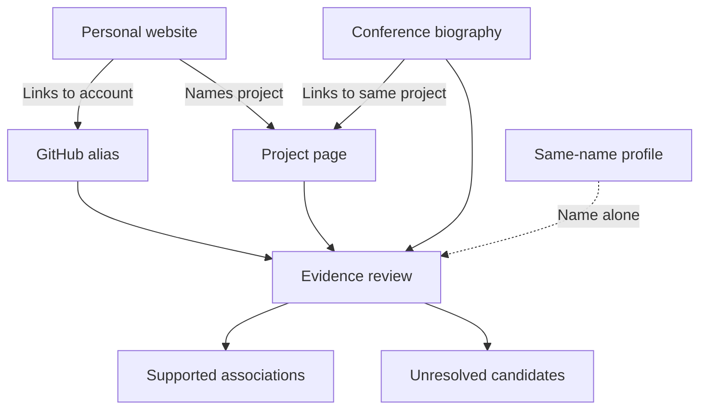
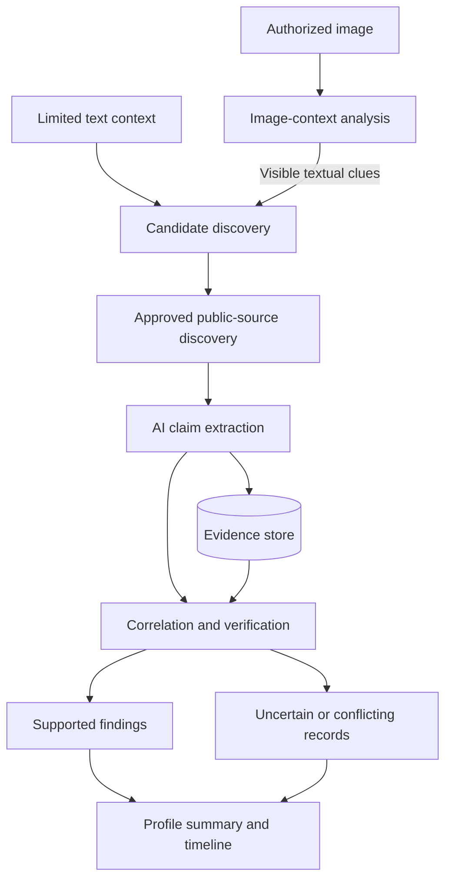

# Temporal Nexus

### Connect the traces. Resolve the identity.

**Public Profile & Digital Footprint Intelligence**

NEURAX Hackathon 3.0 · AI in Cybersecurity

Connecting fragmented public records across platforms and time—with evidence behind every association.

[Problem Understanding](#problem-understanding) · [Architecture](#architecture) · [Approach](#approach) · [Demo Plan](#demo-plan)

> [!NOTE]
> **Checkpoint 01 — Design proposal**
> This README describes our intended solution, architecture and evaluation approach. Implementation and testing are pending; diagrams and examples represent proposed behavior.

---

## Problem Understanding

### One person. Different usernames. A history scattered across sources.

A project appears under a GitHub alias. A conference lists a full name. A company page records a professional role. An older article describes a previous affiliation.

These records may describe the same person—but a matching name alone cannot establish that connection.

**Temporal Nexus asks: Which traces belong together, what supports the connection, and when was each fact true?**

The cybersecurity challenge is avoiding false attribution while examining public identities. Incorrectly merging profiles can associate someone with another person’s work, accounts or activities.

### From scattered records to supported connections

*Illustrative scenario only—not collected data or a demonstrated result.*

| What enters | What the system should produce |
|---|---|
| An authorized image and limited context, such as name, username or organization | Candidate identities with supporting and conflicting evidence |
| Relevant records discovered from approved public sources | Associated profiles, roles, organizations, events and contributions |
| Source text and documented dates | Structured findings with citations and a timeline or relationship graph |

The intended information scope includes projects, products, publications, patents and technical contributions **where public evidence exists**. An event mention must not automatically become confirmed attendance; missing search results must not become proof of absence.

The contribution goes beyond scraping or reverse-image search: **discovery must lead to reasoned associations, traceable claims and visible uncertainty.**

---

## Architecture

### Every connection keeps its evidence

| Component | Responsibility |
|---|---|
| **Input and scope** | Capture supplied context, consent scope and permitted sources |
| **Image-context analysis** | Extract visible text, such as a badge, username or event name, to inform discovery |
| **Candidate and source discovery** | Find possible identities and relevant public records while keeping candidates separate |
| **AI extraction** | Structure names, roles, organizations, activities and dates from retrieved material |
| **Correlation and verification** | Evaluate cross-links, corroborating details and contradictions before associating records |
| **Evidence store and presentation** | Retain URLs, excerpts, retrieval dates and decision reasons; expose them alongside results |

**AI’s proposed role:** interpreting unstructured source material and suggesting associations. Extracted claims must remain grounded in retrieved evidence; model-generated statements are not evidence themselves.

> [!IMPORTANT]
> **Image scope remains an open requirement.**
> The official brief calls for image-associated identity discovery. Our current proposal uses non-facial textual/contextual clues from the image and does not include facial identification or face matching. A plain headshot may yield no usable clues. Organizer acceptance of this scope must be confirmed before the architecture is frozen.

---

## Approach

### Discover a trace. Examine the connection. Preserve the reason.

1. **Establish the test case.** Use our own authorized identity and limited input. Maintain expected findings separately for evaluation, without supplying those answers to the discovery engine.

2. **Build candidate context.** Combine supplied details with usable image-derived text. Record uncertain readings and retain alternative candidates.

3. **Discover public sources.** Search within approved boundaries and follow relevant links. Potential sources include professional/social profiles, personal websites, company pages, event records and project pages. Platform coverage depends on approval and accessible information.

4. **Extract claims with evidence.** Capture what a source actually states, its URL, supporting excerpt and any documented dates.

5. **Correlate across sources.** Consider explicit account links, aliases and corroborating professional details. A shared name is insufficient; repeated copies of one biography do not count as independent confirmation.

6. **Assess each association and claim.** Explain supporting evidence, contradictions and gaps. Keep uncertain records separate instead of forcing a complete identity.

7. **Organize across time.** Present supported activities chronologically and connect entities through evidenced relationships.

### What earns confidence?

| Evidence situation | Intended handling |
|---|---|
| A confirmed website explicitly links an account, with consistent context | Strong support for the association; retain the linking evidence |
| Several independent details agree, but no direct link exists | Candidate association requiring further corroboration |
| Only the display name matches | Insufficient evidence to merge |
| Material details conflict | Flag the conflict and reassess the association |
| Sources are missing or inaccessible | Report the coverage gap |

Confidence will be an **explained assessment of evidence strength**, not an unvalidated probability. Confidence in an account association does not automatically verify every claim on that account.

### Across time, not just across platforms

Temporal Nexus will distinguish:

- **Activity date:** when an event, role or contribution occurred.
- **Publication date:** when the source was published, if known.
- **Retrieval date:** when the system accessed it.

A previous employer remains a historical affiliation. Unknown dates remain unknown. Each timeline entry or relationship should lead back to its evidence.

---

## Demo Plan

### Show both a connection and a reason to stop

Organizers will not provide a dataset. We will prepare our own consented test case and clearly label any controlled or synthetic sources.

The proposed MVP is one complete workflow demonstrating:

| Test case | Expected behavior |
|---|---|
| The same person uses different usernames | Associate records when evidence supports the connection |
| An unrelated record shares the name | Keep it separate unless stronger evidence appears |
| Sources describe different historical roles | Preserve the dates and distinguish change from contradiction |
| Evidence is incomplete or conflicting | Show uncertainty without inventing missing information |
| A finding appears in the timeline | Make its supporting source inspectable |

Evaluation will compare results against a separate expected-results checklist: correct associations, false associations, missed expected records, unresolved cases and evidence coverage.

**Live public discovery and controlled-source testing will be reported separately.** A controlled demonstration can test correlation, but does not establish open-web discovery performance.

---

## Scope and Checkpoint Status

This is a **software-only prototype proposal** using authorized public information. Private-account access, leaked data and access-control bypasses are outside scope.

| Item | Current status |
|---|---|
| Project name and Checkpoint 01 presentation format | Finalized |
| Problem understanding and evidence-focused direction | Defined |
| Architecture and matching approach | Proposed |
| Image-method acceptance and approved source coverage | Pending clarification |
| Test identity and demo source preparation | Pending |
| Implementation, performance and evaluation results | Not yet demonstrated |

### Setup

No runnable application or installation procedure is available at this checkpoint. Prerequisites, configuration examples and tested launch instructions will be added with the first working implementation.

---

**Temporal Nexus makes the connection inspectable: what was found, why it belongs, when it applied, and what remains uncertain.**
