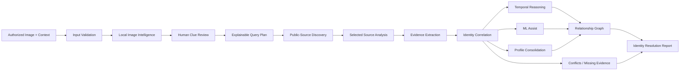
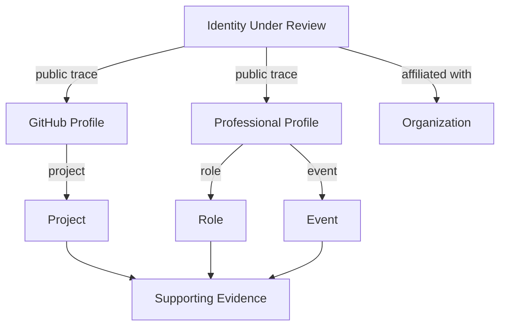
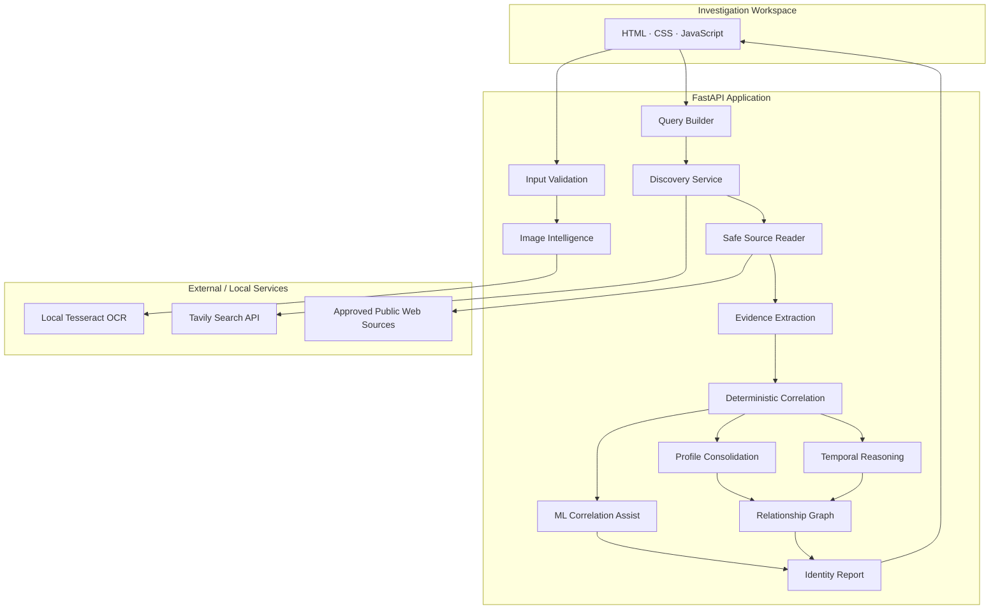

<div align="center">

# TEMPORAL NEXUS

### Connect the traces. Resolve the identity.

**An evidence-first public digital identity intelligence system**

**NEURAX Hackathon 3.0 · AI in Cybersecurity**

---

**Image Intelligence · Public-Source Discovery · Evidence Correlation · Temporal Reasoning · Relationship Mapping**

</div>

---

## The Idea

A person's public digital identity rarely exists in one place.

A developer may use one username on GitHub, appear under a full name on an event page, be mentioned on an organization website, maintain a personal portfolio, and have older public records describing previous roles or projects.

Finding those pages individually is relatively easy.

The difficult question is:

> **Do these scattered digital traces actually belong to the same person — and what evidence proves the connection?**

**Temporal Nexus** is built around that problem.

Instead of treating search results, matching names, or OCR detections as proof, Temporal Nexus creates a traceable investigation pipeline that discovers public information, extracts structured observations, compares evidence across sources, preserves conflicts and uncertainty, and produces an explainable identity-resolution report.

The system is designed around one principle:

> **What was found. Why it connects. When it applied. What remains uncertain.**

---

# Why Temporal Nexus?

Traditional searches return pages.

Temporal Nexus attempts to answer a more difficult set of questions:

* Which discovered profiles are actually relevant to the person under investigation?
* Are two usernames connected by evidence or merely similar?
* Does an event page genuinely associate the subject with that event?
* Is an organization a current affiliation or only a historical one?
* Does a discovered page describe the person, or is the person's name merely mentioned?
* Do multiple sources independently support the same association?
* Are there contradictions that should prevent an automatic identity merge?
* Can every important conclusion be traced back to its supporting source?

Temporal Nexus therefore treats **identity resolution as an evidence problem rather than a search problem**.

---

# Core Philosophy

Temporal Nexus does **not** operate using:

> `Search result → Same name → Same person`

Instead, the workflow is:

> `Input → Clues → Discovery → Source Evidence → Correlation → Temporal Analysis → Relationship Mapping → Explainable Report`

A clue helps locate evidence.

Evidence supports or contradicts an association.

Only then can the system decide whether a digital trace should be connected to the identity being investigated.

---

# What Temporal Nexus Does

Given an **authorized reference image** and optional known information such as:

* Name
* Username
* Organization
* Role / designation
* Department

Temporal Nexus can:

1. Validate the submitted image and consent.
2. Extract visible text from the image locally.
3. Allow a human reviewer to correct and classify OCR results.
4. Convert approved clues into explainable search queries.
5. Discover candidate public sources.
6. Safely inspect selected public pages.
7. Extract subject-focused observations and their evidence.
8. Normalize discovered public-profile records.
9. Compare source evidence against the supplied identity.
10. Detect supporting, missing and conflicting signals.
11. Perform conservative temporal reasoning.
12. Consolidate connected public profiles.
13. Apply an ML-assisted association score as secondary evidence.
14. Build an evidence-backed relationship graph.
15. Produce a structured Identity Resolution Report.

---

# End-to-End Investigation Pipeline



---

# Six Investigation Stages

The interface presents the investigation as six connected stages.

## 01 · Case Input

The investigation begins with only the information that is legitimately known.

Users provide:

* a reference image;
* optional name;
* optional username;
* optional organization;
* optional role;
* optional department;
* explicit authorization confirmation.

Supported image constraints include:

* JPEG / PNG;
* maximum size of approximately **5 MiB**;
* maximum image resolution of **20 megapixels**.

Input supplied directly by the user remains separate from information later extracted from the image or discovered on public sources.

This separation is important because supplied context should not silently become "evidence" for itself.

---

## 02 · Image Intelligence

Temporal Nexus performs **local scene-text OCR** using Tesseract.

Unlike a single document-style OCR pass, the image intelligence module performs multiple bounded passes across:

* the complete image;
* an enhanced grayscale/autocontrast version;
* overlapping image regions.

This improves the chances of extracting useful contextual text from photographs containing:

* banners;
* conference boards;
* badges;
* organization names;
* event names;
* visible usernames;
* signage.

### Human-in-the-Loop Review

OCR output is never automatically accepted as identity evidence.

The reviewer can:

* inspect extracted lines;
* see OCR confidence;
* correct incorrectly recognized text;
* classify a clue;
* select or reject individual clues;
* add clearly visible text missed by OCR.

The **original OCR observation is preserved** even when a reviewer corrects it.

Reviewer-added information is also explicitly marked so it cannot be misrepresented as OCR output.

### Important distinction

**OCR confidence ≠ identity confidence.**

Reading text successfully from an image does not prove that the text describes the person shown in the image.

For example:

> Detecting the words **"NEURAX Hackathon"** on a banner can provide a useful search clue.

It does **not** independently prove that the person attended, organized or participated in that event.

---

# 03 · Explainable Query Intelligence

Selected clues and supplied context are transformed into a bounded search plan.

Rather than hiding search construction inside a black box, Temporal Nexus exposes:

* the generated query;
* the clue or supplied field that caused it;
* its intended search scope;
* platform-specific variations where appropriate.

This lets the reviewer understand:

> **Why is the system searching for this?**

Search planning is deliberately separated from actual discovery.

Preparing a query does not make an external request.

---

# 04 · Public-Source Discovery

Temporal Nexus uses the **Tavily Search API** to discover candidate pages from the public web.

Potential public traces can include:

* GitHub profiles;
* LinkedIn pages;
* personal websites;
* organization pages;
* event records;
* public YouTube pages;
* X / Twitter pages;
* Instagram pages;
* publication or academic references;
* project pages;
* other publicly indexed sources.

Search results remain explicitly marked as:

> **UNVERIFIED CANDIDATES**

A search result appearing relevant is not sufficient to associate it with the subject.

The reference image itself is **not transmitted to Tavily**.

Only prepared textual search queries are used for discovery.

URLs are normalized and tracking parameters are removed before candidate consolidation where possible.

---

# 05 · Source Intelligence

Discovery tells us **where evidence might exist**.

Source Intelligence determines **what the page actually supports**.

The reviewer can select a small number of candidate pages for deeper analysis.

Temporal Nexus reads only accessible public HTTP/HTTPS content.

It does not attempt to bypass:

* authentication;
* private accounts;
* access controls;
* restricted pages;
* network protections.

### Safe Source Reader

The source reader includes controls designed to prevent unsafe server-side retrieval.

It rejects destinations such as:

* localhost;
* private network addresses;
* link-local addresses;
* reserved/internal addresses.

Requests are bounded by:

* network timeout;
* response-size limits;
* redirect limits;
* supported text/HTML content types.

Restricted or inaccessible pages are recorded as unavailable rather than bypassed.

---

# Evidence Extraction

For each accessible source, Temporal Nexus extracts structured observations conservatively.

Sources examined can include:

* visible page text;
* page title;
* metadata;
* JSON-LD structured data;
* supported profile markup;
* explicit labels;
* candidate profile URLs;
* explicit public-profile cross-links.

Possible observations include:

| Observation  | Example                 |
| ------------ | ----------------------- |
| Name         | Alex Kumar              |
| Username     | alexk_dev               |
| Organization | Example Technologies    |
| Role         | Software Engineer       |
| Department   | Computer Science        |
| Event        | Security Hackathon 2026 |
| Project      | SecureGate              |
| Publication  | Research paper title    |
| Education    | Institution             |
| Location     | Hyderabad               |
| Date         | 2026                    |
| Profile link | Public GitHub profile   |

Each important observation keeps its supporting evidence.

Temporal Nexus also separates information about the **subject of the page** from unrelated metadata such as:

* article authors;
* website publishers;
* site-owned social links.

This reduces the risk of incorrectly assigning a publisher's or author's identity to the subject being investigated.

---

# 06 · Identity Correlation

Correlation is the central intelligence layer of Temporal Nexus.

The system compares the supplied identity and approved image clues against observations extracted from public sources.

It evaluates evidence for fields such as:

* name;
* username;
* organization;
* role;
* department;
* event.

A shared name by itself is intentionally weak evidence.

Usernames are compared conservatively, and identity fields are not freely merged simply because similar text appears on multiple pages.

The system records:

* matching signals;
* missing signals;
* conflicting signals;
* source evidence;
* cross-source corroboration;
* unresolved observations.

---

# Evidence States

Temporal Nexus avoids presenting identity resolution as a misleading single accuracy percentage.

Instead, individual claims can be represented using evidence states such as:

| State                   | Meaning                                                |
| ----------------------- | ------------------------------------------------------ |
| **Supported**           | Available evidence supports the association            |
| **Partially Supported** | Some useful evidence exists, but support is incomplete |
| **Conflicting**         | Available evidence directly disagrees                  |
| **Missing**             | Evidence for the supplied field was not found          |
| **Not Assessed**        | Available sources do not support a reliable assessment |

A result such as:

> **4 / 5 supplied fields supported**

represents **evidence coverage**, not a 80% probability that the identity is correct.

---

# Deterministic Correlation + ML Assist

Temporal Nexus intentionally combines two different reasoning layers.

## Deterministic Evidence Layer

The deterministic system remains authoritative.

It uses explicit source observations, supplied fields, reviewed clues, public-profile links and conflicts to determine the evidence state.

This layer is designed to remain understandable and auditable.

## Custom ML-Assisted Correlation

Temporal Nexus also contains a lightweight custom logistic-regression baseline.

The model is trained locally on controlled synthetic **same-person / different-person** feature pairs.

Features include signals such as:

* name match;
* username match;
* organization match;
* role match;
* department match;
* explicit profile cross-linking;
* direct page availability;
* evidence support density;
* missing evidence density;
* temporal consistency;
* explicit conflict presence.

The model produces an **association score** and strength band.

### Important

The ML score is:

* **not a calibrated identity probability**;
* not independent proof;
* not allowed to override deterministic conflicts.

If an explicit contradiction exists, the system deliberately limits the ML score rather than allowing the model to "explain away" contradictory evidence.

The ML layer therefore acts as:

> **secondary decision support, not the final authority.**

---

# Temporal Reasoning

Digital identity changes over time.

Someone may:

* leave an organization;
* change roles;
* participate in an event years earlier;
* work on different projects at different points;
* have old public profiles that remain indexed.

Temporal Nexus therefore distinguishes between:

* current evidence;
* historical evidence;
* explicit dates;
* date ranges;
* undated observations.

The temporal reasoning engine uses only dates or temporal labels that actually appear in evidence.

It does **not invent missing employment or participation histories**.

For example:

> A historical organization different from the current supplied organization is preserved as historical context.

It is not automatically considered a contradiction.

However:

> A source explicitly claiming a different **current** organization may be flagged for review as a temporal conflict.

---

# Evidence-Backed Timeline

When reliable temporal observations exist, Temporal Nexus can organize them chronologically.

Potential timeline elements include:

* roles;
* organizations;
* events;
* projects;
* publications;
* education;
* locations.

A timeline entry is only created when sufficient temporal information exists.

An undated mention is not silently converted into a historical event.

---

# Relationship Graph

Temporal Nexus builds a compact relationship graph around the resolved identity.

Possible node types include:

* Identity
* Public Profile
* Organization
* Role
* Department
* Project
* Event
* Publication
* Education
* Location

Possible relationships include:

* `public trace`
* `affiliated with`
* `role`
* `department`
* `project`
* `event`
* `publication`

Each relationship can carry:

* evidence state;
* supporting source URLs;
* evidence count.



The graph is therefore not merely decorative.

It represents **evidence-backed relationships** extracted from the investigation.

---

# Identity Resolution Report

The final stage converts technical observations into a reviewer-friendly investigation report.

The report is organized around the **identity decision**, not around a dump of search results.

## 1. Most Supported Identity

Shows the canonical supplied identity and the strongest evidence-backed association state.

## 2. Connected Public Footprint

Shows normalized public profiles that have sufficient evidence to be connected or partially connected.

Repositories, posts, articles and subpages remain **supporting evidence**, rather than being presented as separate identities.

## 3. Temporal Reasoning

Shows dated, historical and current observations without manufacturing missing history.

## 4. Relationship Graph

Shows evidence-backed connections between the identity, profiles, organizations, roles, projects, events and other entities.

## 5. Evidence

Allows important findings to be traced back to exact source material.

## 6. Conflicts & Uncertainty

Keeps:

* contradictory information;
* inaccessible sources;
* missing evidence;
* unresolved candidates

separate from the supported public footprint.

The report intentionally preserves uncertainty instead of hiding it.

---

# System Architecture



---

# Technology Stack

| Layer             | Technology                                                 |
| ----------------- | ---------------------------------------------------------- |
| Backend           | Python                                                     |
| API Framework     | FastAPI                                                    |
| ASGI Server       | Uvicorn                                                    |
| Frontend          | HTML5, CSS3, Vanilla JavaScript                            |
| Image Processing  | Pillow                                                     |
| OCR Integration   | pytesseract                                                |
| OCR Engine        | Tesseract OCR                                              |
| Public Discovery  | Tavily Search API                                          |
| Structured Data   | Python models / JSON                                       |
| ML Baseline       | Custom dependency-light logistic regression                |
| Testing           | Automated backend/workflow tests + manual testing workflow |
| API Documentation | FastAPI Swagger / OpenAPI                                  |

The application deliberately keeps the stack lightweight enough for a hackathon prototype while maintaining clear separation between the investigation stages.

---

# API Overview

FastAPI exposes the main investigation operations.

| Method | Endpoint               | Purpose                                      |
| ------ | ---------------------- | -------------------------------------------- |
| `GET`  | `/`                    | Serve the investigation workspace            |
| `GET`  | `/docs`                | Interactive FastAPI API documentation        |
| `GET`  | `/api/health`          | Backend availability check                   |
| `POST` | `/api/input`           | Validate image, consent and supplied context |
| `POST` | `/api/image-clues`     | Perform local OCR and return image clues     |
| `POST` | `/api/search-plan`     | Generate explainable search queries          |
| `POST` | `/api/discover`        | Discover candidate public sources            |
| `POST` | `/api/analyze-sources` | Read selected sources and extract evidence   |
| `POST` | `/api/correlate`       | Produce identity-correlation results         |

---

# Project Structure

```text
Temporal_Nexus/
│
├── backend/
│   ├── main.py
│   ├── models.py
│   ├── database.py
│   │
│   └── services/
│       ├── input_validation.py
│       ├── image_clues.py
│       ├── indexed_clues.py
│       ├── query_builder.py
│       ├── discovery.py
│       ├── source_reader.py
│       ├── extraction.py
│       ├── platforms.py
│       ├── profiles.py
│       ├── profile_records.py
│       ├── profile_markup.py
│       ├── profile_consolidation.py
│       ├── correlation.py
│       ├── ml_correlation.py
│       ├── temporal_reasoning.py
│       ├── relationship_graph.py
│       └── identity_report.py
│
├── frontend/
│   ├── index.html
│   ├── styles.css
│   ├── app.js
│   └── report.js
│
├── data/
│
├── tests/
│
├── .env.example
├── .gitignore
├── MANUAL_TESTING.md
├── requirements.txt
└── README.md
```

---

# Running Temporal Nexus Locally

## Prerequisites

Install:

* Python
* pip
* Tesseract OCR
* Git

A Tavily API key is required for live public-source discovery.

---

## 1. Clone the Repository

```bash
git clone https://github.com/sdheeraj4/Temporal_Nexus.git
cd Temporal_Nexus
```

---

## 2. Create a Virtual Environment

### Windows

```powershell
python -m venv .venv
.venv\Scripts\Activate.ps1
```

### Linux / macOS

```bash
python3 -m venv .venv
source .venv/bin/activate
```

---

## 3. Install Python Dependencies

```bash
pip install -r requirements.txt
```

Core Python dependencies include:

```text
fastapi
uvicorn
Pillow
python-multipart
pytesseract
python-dotenv
```

---

## 4. Install Tesseract OCR

Temporal Nexus performs OCR locally and therefore requires the actual **Tesseract executable**, not only the Python `pytesseract` package.

Verify the installation:

```bash
tesseract --version
```

English language data must also be available.

If Tesseract is not available globally on Windows, its executable can be configured through the environment variable:

```text
TESSERACT_CMD=
```

---

## 5. Configure Environment Variables

Copy:

```text
.env.example
```

to:

```text
.env
```

Configure:

```env
TAVILY_API_KEY=your_tavily_api_key_here

# Optional if Tesseract is not available on PATH
TESSERACT_CMD=
```

### Security

Never commit the real `.env` file.

The repository intentionally tracks only `.env.example`.

---

## 6. Start the Application

From the project root:

```bash
uvicorn backend.main:app --reload
```

Then open:

```text
http://127.0.0.1:8000/
```

API documentation:

```text
http://127.0.0.1:8000/docs
```

Health check:

```text
http://127.0.0.1:8000/api/health
```

---

# Typical Investigation Flow

### Step 1

Upload an authorized reference image.

Optionally provide known identity context.

### Step 2

Confirm authorization.

### Step 3

Run Image Intelligence.

### Step 4

Review the OCR output.

Correct, classify, select or manually add visible clues.

### Step 5

Generate the query plan.

Review why each query was created.

### Step 6

Run public-source discovery.

Candidate results remain unverified.

### Step 7

Select relevant candidate sources.

### Step 8

Analyze the selected public pages.

### Step 9

Inspect extracted observations and supporting excerpts.

### Step 10

Run identity correlation.

### Step 11

Review:

* supported fields;
* missing fields;
* conflicts;
* public profiles;
* ML assist;
* temporal reasoning;
* timeline;
* relationship graph;
* evidence provenance.

---

# Security and Responsible-Use Boundaries

Temporal Nexus is a cybersecurity research prototype built for an **authorized public-information workflow**.

The application is intentionally designed with boundaries.

## The system does

* require authorization confirmation;
* process OCR locally;
* search publicly indexed information;
* analyze accessible public pages;
* preserve source provenance;
* expose uncertainty;
* separate clues from proof;
* retain conflicts instead of hiding them.

## The system does not

* access private accounts;
* bypass authentication;
* bypass paywalls or access controls;
* use leaked databases;
* exploit websites;
* access internal/private network targets through the source reader;
* infer sensitive attributes from someone's appearance;
* treat a shared name as proof of identity;
* treat an OCR result as proof;
* treat an ML score as identity probability.

---

# Image and Facial Identification Scope

The current Temporal Nexus build uses the supplied image primarily as a source of **contextual visual text**.

Examples include:

* event banners;
* organization names;
* badge text;
* visible usernames;
* conference titles.

The current release does **not perform biometric facial identification** and does not claim that a face alone can establish ownership of a public account.

This is deliberate.

A face match by itself would still not prove that:

* a social-media account is controlled by the person;
* an employment claim is genuine;
* an event was attended;
* a project was created by that individual.

Temporal Nexus therefore focuses on **evidence-backed public identity correlation**.

---

# Privacy

The investigation interface is designed so that submitted images and context are not treated as a permanent identity database.

The project focuses on bounded analysis of an authorized case.

Real credentials, uploaded images and private environment configuration should remain outside version control.

---

# Key Design Decisions

## 1. Evidence before confidence

The system explains the reason behind an association before displaying a confidence-oriented result.

## 2. Human review before discovery

OCR is useful but imperfect. A reviewer can correct mistakes before those mistakes become search queries.

## 3. Candidate ≠ identity

Discovery results remain candidates until source evidence is analyzed.

## 4. Missing ≠ conflicting

A source failing to mention an organization is different from a source explicitly claiming another current organization.

Temporal Nexus keeps those states separate.

## 5. Historical ≠ incorrect

Older affiliations are preserved as history rather than automatically treated as contradictions.

## 6. ML assists; evidence decides

The custom ML baseline can help rank associations, but explicit evidence and deterministic conflicts remain authoritative.

## 7. Provenance is part of the result

A finding without traceable evidence is intentionally weaker than a finding that can be opened and inspected.

---

# Current Implementation Status

| Component                            | Status                        |
| ------------------------------------ | ----------------------------- |
| Input and consent validation         | ✅ Implemented                 |
| Image validation                     | ✅ Implemented                 |
| Multi-pass local scene OCR           | ✅ Implemented                 |
| OCR clue review                      | ✅ Implemented                 |
| Reviewer corrections                 | ✅ Implemented                 |
| Reviewer-added visual clues          | ✅ Implemented                 |
| Explainable query generation         | ✅ Implemented                 |
| Tavily public-source discovery       | ✅ Implemented                 |
| Candidate normalization              | ✅ Implemented                 |
| Safe public-source reader            | ✅ Implemented                 |
| Subject-focused evidence extraction  | ✅ Implemented                 |
| Public-profile normalization         | ✅ Implemented                 |
| Deterministic identity correlation   | ✅ Implemented                 |
| Conflict / missing evidence handling | ✅ Implemented                 |
| Profile consolidation                | ✅ Implemented                 |
| Synthetic-trained ML assist          | ✅ Implemented                 |
| Temporal reasoning                   | ✅ Implemented                 |
| Evidence-backed timeline             | ✅ Implemented                 |
| Relationship graph                   | ✅ Implemented                 |
| Identity Resolution Report           | ✅ Implemented                 |
| Investigation workspace UI           | ✅ Implemented                 |
| Facial biometric identification      | ❌ Not part of current release |
| Private-account access               | ❌ Intentionally unsupported   |

---

# Testing

Temporal Nexus includes automated tests covering major backend and workflow behavior.

The project also contains:

```text
MANUAL_TESTING.md
```

for end-to-end manual verification of the investigation workflow.

Testing should cover cases such as:

* valid and invalid image uploads;
* consent enforcement;
* image with readable contextual text;
* image without useful text;
* OCR correction;
* reviewer-added clues;
* query provenance;
* duplicate query handling;
* public discovery;
* inaccessible sources;
* same-name false candidates;
* corroborating usernames;
* organization matches;
* explicit conflicts;
* historical affiliations;
* temporal consistency;
* profile consolidation;
* relationship graph generation;
* ML-assisted scoring.

---

# Example Reasoning

Suppose the seed identity contains:

```text
Name: Alex Kumar
Organization: Example Institute
```

The uploaded image contains a banner:

```text
CyberSec Summit 2026
```

Temporal Nexus may use the reviewed banner text to discover an event page.

That event page alone is **not proof that Alex Kumar participated**.

If the event page explicitly contains:

```text
Alex Kumar — Example Institute
```

that provides stronger corroborating evidence.

If another public profile explicitly links to the same event page and also matches the known organization, the association becomes stronger.

If another page belongs to a different Alex Kumar at another organization, it remains separate rather than being merged merely because the names match.

That difference is the core of Temporal Nexus.

---

# What Makes Temporal Nexus Different?

Temporal Nexus is not designed as another:

* username search engine;
* reverse-image-search interface;
* OSINT link aggregator;
* social-profile finder.

Its central output is not:

> "Here are pages containing this name."

Its goal is:

> **"Here are the public records that can be responsibly connected, the evidence supporting those connections, their temporal context, and the information that remains unresolved."**

---

# Limitations

Temporal Nexus remains a hackathon prototype.

Important limitations include:

* public web coverage is incomplete;
* search providers cannot guarantee discovery of every relevant page;
* platforms may restrict direct page access;
* JavaScript-heavy pages may not expose useful server-readable content;
* OCR quality depends on image quality and visible text;
* plain headshots may provide no textual image clues;
* public information itself can be inaccurate;
* copied biographies are not necessarily independent corroboration;
* missing search results do not prove that information does not exist;
* ML training uses controlled synthetic feature pairs rather than a large real-world identity dataset;
* the ML score is not a calibrated probability;
* evidence-backed association does not guarantee legal identity or account ownership.

These limitations are shown rather than hidden because explainability is part of the project's design.

---

# Future Scope

Possible extensions include:

* richer authorized identity-resolution evaluation datasets;
* improved entity extraction;
* larger-scale temporal reasoning;
* stronger duplicate-source detection;
* enhanced graph exploration;
* configurable source policies;
* exportable investigation reports;
* controlled human-review workflows;
* improved model training using properly consented labelled datasets;
* additional evidence-quality metrics;
* optional deployment architecture for multi-user investigations.

Any future biometric component would require separate privacy, consent, accuracy, security and misuse analysis.

---

# Hackathon Context

**Project:** Temporal Nexus
**Theme:** AI in Cybersecurity
**Event:** NEURAX Hackathon 3.0

Temporal Nexus was developed as a software-only cybersecurity prototype exploring how AI-assisted and deterministic techniques can help organize fragmented public digital evidence while preserving:

* provenance;
* uncertainty;
* temporal context;
* reviewer control;
* security boundaries.

---

# Responsible Use

Temporal Nexus should only be used on information that the user is legally and ethically authorized to investigate.

Public availability does not remove the need for responsible use.

The project is intended for:

* cybersecurity research;
* authorized demonstrations;
* consented identity-resolution experiments;
* evidence-correlation research;
* educational use.

It should not be used for harassment, stalking, unauthorized surveillance or attempts to bypass privacy controls.

---

<div align="center">

## TEMPORAL NEXUS

### Connect the traces. Resolve the identity.

**Finding information is easy.
Explaining why it belongs to the same identity is the real problem.**

---

**What was found · Why it connects · When it applied · What remains uncertain**

</div>
