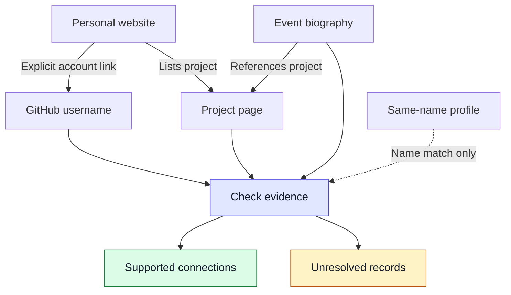
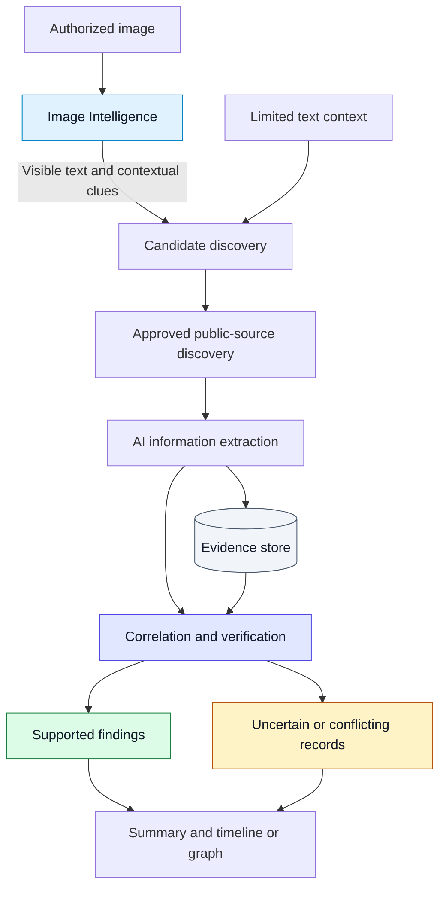

# Temporal Nexus

### Connect the traces. Resolve the identity.

**Public Profile & Digital Footprint Intelligence**

NEURAX Hackathon 3.0 · AI in Cybersecurity

Connecting a person’s scattered public records across platforms and across time—with evidence behind each connection.

[Problem Understanding](#problem-understanding) · [Architecture](#architecture) · [Approach](#approach) · [Checkpoint Progress](#checkpoint-progress)

> [!NOTE]
> **Current stage:** A working core prototype now validates inputs, extracts/reviews OCR clues, prepares explainable queries, discovers public candidates with Tavily, safely reads selected sources, extracts source-backed subject observations, and performs deterministic evidence correlation. Advanced ML scoring and the full timeline/relationship graph remain; the Checkpoint 2 investigation workspace and evidence presentation are implemented.

---

## Updated evidence workspace

The final stage now opens a concise **Identity Resolution Report**: summary → seed corroboration → canonical Connected Public Profiles → additional public observations → missing/conflicting evidence → collapsed audit/source records. Repositories, posts, status URLs and personal-site subpages are supporting evidence, not separate people/profile cards.

- Optional **role** and **department** travel through validation, query preparation and report comparison.
- Supplied values stay canonical; partial OCR fragments cannot replace them.
- **Supported / partial / conflicting / missing / not assessed** distinguish evidence states.
- `X / Y supplied fields supported` is coverage, never an identity probability.
- Page-level mentions alone do not count as person-linked support in the report.
- Navigation links, keyboard focus, responsive report layout and reduced-motion styling support the review workflow.

Start and retest with [MANUAL_TESTING.md](MANUAL_TESTING.md). This is a deterministic prototype; facial identification, trained ML scoring and the full personal timeline remain outside this release. The report does not establish account ownership or source authenticity.

---

## Problem Understanding

### Different platforms. Different names. Possibly the same person.

A person might publish code under a GitHub username, appear on an event page under their full name, and describe their work on a personal website.

An older company page may show a previous role. Another profile may share the same name but belong to someone else.

**Which records belong together—and what evidence supports that decision?**

Temporal Nexus aims to answer this question by discovering public information, checking connections between records, and organizing supported findings over time.

| Input | Intended output |
|---|---|
| An authorized image and limited details, such as a name, username or organization | Candidate identities with explained associations |
| Clues extracted from the image and approved public sources | Relevant profiles, roles, organizations, events and contributions |
| Supporting source material and documented dates | Evidence-backed findings, uncertainty labels and a timeline or relationship graph |

The information scope includes projects, products, publications, patents, interviews and technical contributions where evidence is available.

**Finding a page is only the beginning.** The system must establish why it is relevant, what it actually supports, and whether it belongs to the intended person.

### How scattered traces can connect

*Illustrative example—not a collected dataset or working result.*

---

## Architecture

### Image Intelligence + Limited Text Context

The supplied image should contribute useful clues to the search.

The **Image Intelligence** module uses bounded multi-pass local Tesseract OCR for scene text rather than a single document-style OCR pass. It checks the full image plus enhanced overlapping regions so banners, signs, badge text, event titles and organization names are less likely to be lost in photographic clutter. OCR remains unverified: reviewers correct detections, classify them, explicitly select them, and can add clearly visible text that OCR missed. Reviewer-added visual clues are labeled as such and are never presented as OCR detections.

For example, a readable hackathon banner can provide an event name that helps narrow a search using the supplied person’s name.

**The central idea is evidence-backed correlation.** Facial appearance alone cannot establish account ownership or verify someone’s professional activities. Temporal Nexus focuses on connecting observable clues with corroborating public records.

> [!IMPORTANT]
> **A clue guides discovery; it does not prove a claim.**
> A banner does not establish participation, and an organization logo does not establish employment. Those associations require supporting records.

### From input to an explainable result

| Module | What it does |
|---|---|
| **Input and scope** | Records supplied details, authorization and permitted sources |
| **Image Intelligence** | Extracts visible textual clues and preserves uncertain readings |
| **Discovery** | Finds possible identities and relevant public records without prematurely merging candidates |
| **AI extraction** | Organizes source text into names, roles, organizations, activities and dates |
| **Verification** | Checks links, supporting details and contradictions across sources |
| **Evidence and results** | Stores source URLs, excerpts, dates and decision reasons alongside the output |

AI helps interpret source material. Its generated statements are not treated as independent evidence.

---

## Approach

### Discover → Compare → Support → Organize

**1. Start with an authorized test case**

We will prepare our own consented test identity because organizers will not provide a dataset. Expected findings will be kept separately for evaluation, not supplied as answers to the system.

**2. Extract clues from the input**

Combine the supplied context with reviewed image clues. Multi-pass scene OCR preserves the original OCR reading for review, while corrected text is stored separately. If clearly visible text is missed, the reviewer may add it explicitly with reviewer-added provenance. OCR confidence remains separate from confidence in an identity association.

**3. Discover relevant public sources**

Search approved sources and follow relevant account links, aliases and project references. Potential sources include GitHub, LinkedIn, Instagram, X/Twitter, YouTube, personal websites, company pages and event records.

Actual coverage will depend on approval and accessible information; coverage of every platform is not assumed.

**4. Extract facts with their evidence**

For each important finding, retain the source URL, supporting excerpt and available dates. Preserve distinctions such as speaker, participant, organizer or simply being mentioned.

**5. Compare records before connecting them**

Use explicit cross-links and corroborating details about projects, organizations and activities. A shared name alone is insufficient. Copies of the same biography should not count as independent confirmation.

**6. Explain confidence and uncertainty**

Assess each association and claim separately. Show what supports it, what conflicts with it and what is missing.

| Result | Meaning |
|---|---|
| 🟢 **Supported** | Available evidence supports the specific association or claim |
| 🟡 **Uncertain** | Some clues agree, but evidence is insufficient |
| 🟠 **Conflicting** | Sources disagree and need further review |
| ⚪ **Not associated** | The evidence does not justify connecting the record to the subject |

These are evidence assessments, not guarantees or unvalidated accuracy percentages. Missing results mean “not found within the searched sources,” not “does not exist.”

**7. Present the public history**

Produce a structured summary and a timeline or relationship graph. Each activity or connection should open its supporting evidence, with uncertain records clearly separated.

### What an evidence-backed finding looks like

*Illustrative example only.*

| Field | Example |
|---|---|
| **Finding** | A GitHub account is associated with the supplied personal website |
| **Evidence** | The website explicitly links that account |
| **Corroboration** | Both reference the same project |
| **Assessment** | Supported association |
| **Limit** | This does not automatically verify every claim made by the account |

---

## Across Platforms—and Across Time

A person’s public history changes. Temporal Nexus should preserve those changes.

| Date type | Meaning |
|---|---|
| **Activity date** | When the documented event, role or contribution occurred |
| **Publication date** | When the source was published, if available |
| **Retrieval date** | When the system accessed the source |

A previous employer remains a historical affiliation. A publication date is not automatically an event date. Unknown dates remain unknown.

This makes the timeline a record of supported activities rather than a list of everything treated as current.

---

## Demo and Evaluation Plan

### Demonstrate correct connections and sensible uncertainty

The first MVP will demonstrate one complete input-to-evidence workflow using a small, authorized set of sources.

| Test | Expected behavior |
|---|---|
| Different usernames with corroborating evidence | Connect the relevant records and explain why |
| An unrelated same-name record | Avoid an unsupported merge |
| Useful text visible in the image | Show how the extracted clue changes discovery |
| An image without readable contextual clues | Report that no useful image clue was extracted |
| Historical roles or conflicting information | Preserve dates and flag genuine disagreement |
| A timeline entry | Make its supporting source inspectable |

We will compare results with a separate expected-results checklist, tracking correct associations, false associations, missed expected records, unresolved cases and evidence coverage.

Live public discovery and controlled or synthetic test sources will be clearly distinguished. Controlled testing demonstrates behavior within that dataset; it does not establish unrestricted web-search performance.

---

## Checkpoint Progress

| Area | Status |
|---|---|
| Project name and purpose | Finalized |
| Problem analysis and Checkpoint 01 README | Completed |
| Input/consent validation + multi-pass local scene OCR + reviewer fallback | Implemented and tested |
| Clue review + explainable search-plan generation | Implemented and tested |
| Tavily public-source discovery | Implemented; live discovery manually verified |
| Safe source reading + subject-focused extraction | Implemented and tested |
| Basic identity correlation + evidence/conflict assessment | Implemented and tested |
| Checkpoint 2 investigation UI + detailed evidence presentation | Implemented and tested |
| Custom ML-assisted correlation baseline | Implemented: local logistic regression trained on controlled synthetic same/different-person feature pairs; score is not a probability |
| Temporal reasoning / timeline | Implemented conservatively from explicit dates and temporal labels only |
| Evidence-backed relationship graph | Implemented with supported/partial/conflicting edges and source provenance |

**Next milestone:** Run the advanced identity-resolution flow on a richer authorized test identity and evaluate false-match handling, temporal consistency, graph clarity, and ML-vs-deterministic behavior before final presentation.

<strong>Scope, limitations and setup</strong>

### Scope and limitations

- Software-only prototype using authorized public information.
- No private-account access, leaked data or access-control bypasses.
- The proposed image module focuses on OCR and contextual clues. Plain headshots may provide no usable clues; acceptance against the brief’s image-identification requirement remains to be confirmed.
- Blurred badges, partial banners and ambiguous branding may produce uncertain or unusable results.
- Inaccessible or missing sources will be reported as coverage gaps.
- Sensitive personal attributes will not be inferred from appearance.

### Setup

The application runs locally with FastAPI at `http://127.0.0.1:8000/`. Tavily discovery uses a private `TAVILY_API_KEY` loaded from local environment configuration. Real `.env` files, credentials, uploaded images and local data must remain outside Git.

---

**What was found. Why it connects. When it applied. What remains uncertain.**

*Temporal Nexus · Connect the traces. Resolve the identity.*

## Checkpoint 2 report focus

Stage 06 is intentionally organized around the identity-resolution decision rather than around source pages:

1. **Most Supported Identity** — the canonical seed identity plus the current evidence-backed association state.
2. **Connected Public Footprint** — only canonical supported/partially-supported public identity records; repositories, posts, articles and subpages remain evidence.
3. **Temporal Reasoning** — explicit dated/current/historical observations are ordered without inventing employment or attendance history.
4. **Relationship Graph** — evidence-backed links between the seed identity, public profiles, organizations, roles, projects/events/publications and other supported entities.
5. **Evidence** — supplied-field corroboration first, with exact source excerpts available on demand.
6. **Conflicts & Uncertainty** — contradictory, missing, inaccessible and unresolved candidate evidence kept separate from the supported footprint.

The final report also exposes a **custom ML assist score** from a locally trained synthetic logistic-regression baseline. It is used as secondary evidence/ranking only, is not a calibrated probability, and never overrides explicit deterministic conflicts.

Full source records, OCR provenance and technical limitations remain available in collapsed audit drawers. This keeps the default report concise without discarding provenance.
